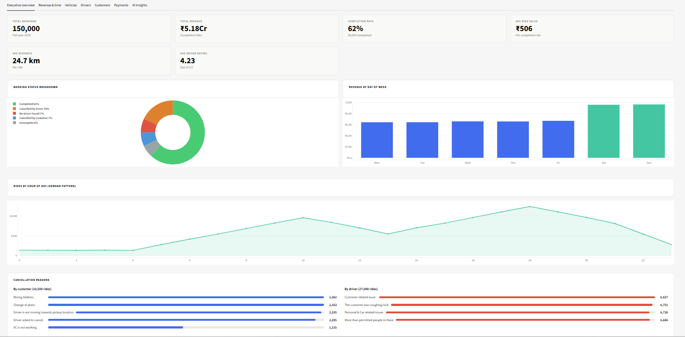
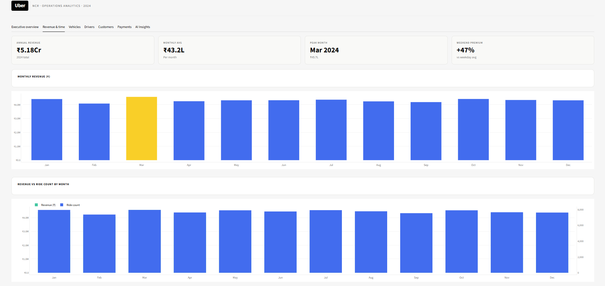
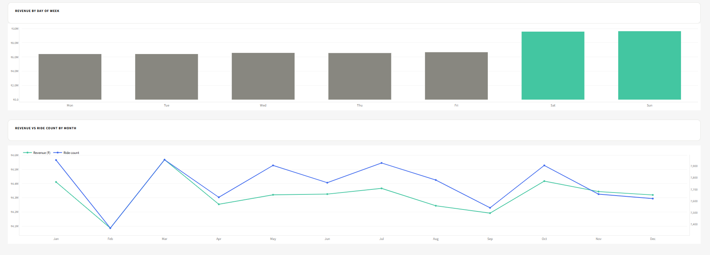
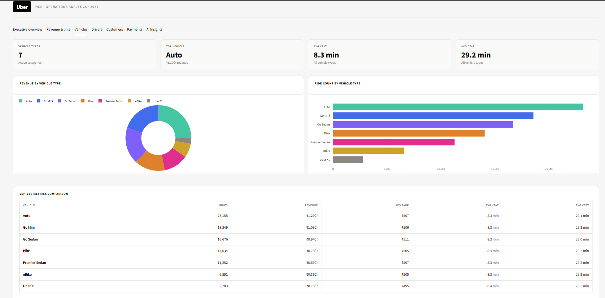
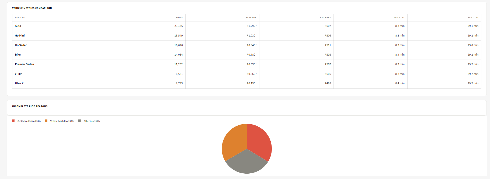
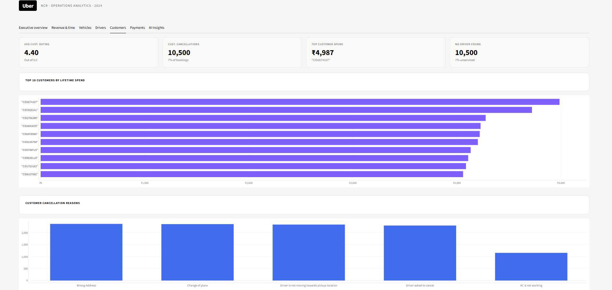
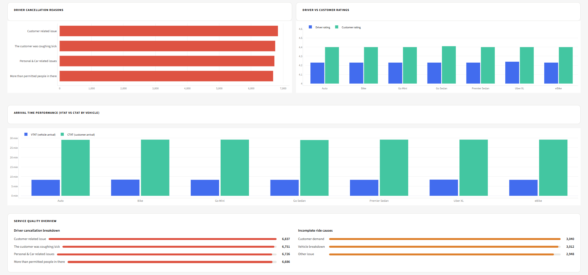
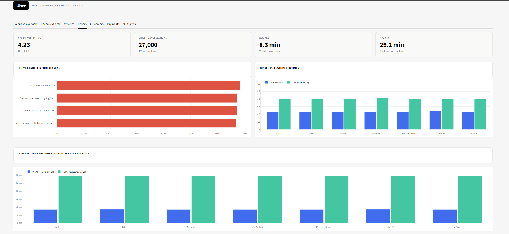
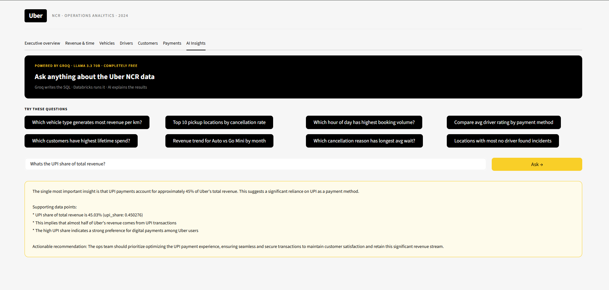

# 🚖 Uber NCR Ride Analytics — End-to-End Data Engineering Project

> **dbt · Databricks Unity Catalog · Groq AI · Streamlit**
>
> A production-grade data engineering project built on 148,770 Uber NCR ride bookings from 2024 — covering ingestion, transformation, SCD2 history tracking, and an AI-powered analytics dashboard.

---

## 📸 Dashboard screenshots

### Executive overview


### Revenue & time



### Vehicles



### Customer Overview


### Payments Overview


### Drivers Overview



### AI insights



## 📐 Architecture

```
CSV Source (148k rows)
    │
    ▼
Databricks Unity Catalog — raw.ride_bookings (Delta table)
    │
    ▼
dbt Transformation Pipeline
    ├── Staging          → cleaned, typed, normalised
    ├── Intermediate     → business logic, metrics, aggregations
    ├── Marts            → wide tables for BI consumption
    └── Snapshots        → SCD Type 2 history (customer tier, driver score)
    │
    ▼
Streamlit Dashboard (7 tabs) + Groq AI Agent (natural language → SQL)
```

---

## 🛠️ Tech stack

| Layer | Tool |
|---|---|
| Cloud warehouse | Databricks Unity Catalog (Serverless SQL) |
| Transformation | dbt Cloud + dbt-databricks adapter |
| Language | Python · Databricks SQL |
| AI agent | Groq API · Llama 3.3 70B (free tier) |
| Dashboard | Streamlit · Plotly |
| Version control | GitHub (via dbt Cloud managed repository) |

---

## 📁 Project structure

```
uber-ride-analytics/
├── dbt_project/
│   ├── dbt_project.yml
│   ├── models/
│   │   ├── sources/
│   │   │   └── sources.yml               # source declarations + freshness checks
│   │   ├── staging/
│   │   │   ├── stg_bookings.sql          # cleaned bookings with null handling
│   │   │   └── stg_customers.sql         # customer lifetime stats + tier logic
│   │   ├── intermediate/
│   │   │   ├── int_ride_metrics.sql      # ride counts, revenue, ratings by dimension
│   │   │   └── int_cancellation_analysis.sql  # cancellation breakdowns
│   │   └── marts/
│   │       ├── mart_revenue_summary.sql       # daily revenue by vehicle + payment
│   │       ├── mart_driver_scorecard.sql      # driver reliability + performance scores
│   │       ├── mart_cancellation_insights.sql # cancellation patterns + rolling 7d
│   │       └── mart_customer_segments.sql     # customer tiers + churn risk + dormancy
│   ├── snapshots/
│   │   ├── customer_tier_snapshot.sql    # SCD2 — customer bronze/silver/gold/platinum
│   │   └── driver_score_snapshot.sql     # SCD2 — driver performance tier by location
│   ├── macros/
│   │   ├── booking_status_label.sql      # maps raw status strings to clean enums
│   │   ├── rating_tier.sql               # maps numeric ratings to tier labels
│   │   └── generate_schema_name.sql      # prevents dbt from prepending target schema
│   ├── seeds/
│   │   ├── vehicle_type_meta.csv         # vehicle categories, capacity, is_premium
│   │   └── cancellation_reasons.csv      # reason categories + is_app_issue flag
│   └── tests/
│       ├── assert_booking_value_positive.sql
│       └── assert_valid_rating.sql
└── uber-streamlit/
    ├── app.py                            # main Streamlit app (7 tabs)
    ├── .streamlit/config.toml            # light theme + Uber brand colours
    └── utils/
        ├── databricks_conn.py            # Databricks SQL connector + query cache
        ├── ai_agent.py                   # Groq SQL generation + insight generation
        └── theme.py                      # Uber CSS theme + Plotly chart defaults
```

---

## 🔄 dbt pipeline layers

### Staging
Cleans raw data — handles literal `'null'` strings using `try_cast(nullif(trim(col), 'null') as double)`, normalises `booking_status_raw` casing, extracts datetime from a combined timestamp column using `try_to_timestamp()`, and applies the `booking_status_label()` macro to map raw values to clean enums.

### Intermediate
Computes business metrics — ride counts by status using `sum(case when)` (Databricks has no `countif`), rolling 7-day cancellation counts using window functions, completion rates, and joins to seed data for vehicle category enrichment.

### Marts
Four wide tables materialised as Delta tables, consumed directly by the dashboard:

| Mart | Grain | Key metrics |
|---|---|---|
| `mart_revenue_summary` | Date × vehicle × payment | Revenue, completed rides, avg fare, revenue/km |
| `mart_driver_scorecard` | Vehicle × location | Reliability score, avg rating, pickup time, completion % |
| `mart_cancellation_insights` | Date × vehicle × reason | Cancel count, avg wait, rolling 7d cancels |
| `mart_customer_segments` | Customer | Tier, churn risk, lifetime spend, dormancy flag |

### SCD2 Snapshots
Two snapshots using `strategy='check'` track dimension changes over time:

- **customer_tier_snapshot** — inserts a new row whenever `customer_tier` or `churn_risk` changes
- **driver_score_snapshot** — inserts a new row whenever `performance_tier` or `reliability_score` changes

Each snapshot produces `dbt_valid_from`, `dbt_valid_to`, `dbt_scd_id`, and `dbt_updated_at` columns. Current records have `dbt_valid_to IS NULL`.

---

## 📊 Dashboard tabs

| Tab | Charts |
|---|---|
| Executive overview | KPIs · booking status donut · revenue by day of week · demand by hour · cancellation reasons |
| Revenue & time | Monthly revenue bar · revenue vs ride count dual-axis line · revenue by DOW |
| Vehicles | Revenue donut · ride count bar · metrics comparison table · incomplete reasons pie |
| Drivers | Cancellation reasons · driver vs customer ratings · VTAT vs CTAT · service quality |
| Customers | Top 10 spenders · cancellation reasons bar · top pickup locations table |
| Payments | Distribution donut · volume bar · detail table with Digital/Offline badge |
| AI Insights | Ask any question → Groq writes SQL → Databricks runs it → auto chart + AI analysis |

---

## 🤖 AI agent

The AI Insights tab uses **Groq's free API** (Llama 3.3 70B, 6000 req/day) to convert natural language questions into Databricks SQL, execute them against Unity Catalog, auto-generate a chart, and explain the business insight.

```
User question
    │
    ▼
Groq (Llama 3.3 70B) → writes Databricks SQL SELECT
    │
    ▼
Databricks SQL warehouse → returns results
    │
    ▼
Plotly → auto chart based on result shape
    │
    ▼
Groq → business insight + recommendation
```

---

## 📈 Key findings from the data

- **148,770** total bookings across 2024
- **62%** completion rate · **25%** cancelled · **13%** incomplete or no driver
- **Auto** is the top vehicle by both rides and revenue (₹1.29Cr)
- **UPI** accounts for **45%** of all payments
- **Weekend revenue** is **46% higher** than weekday average
- **4.23** avg driver rating · **4.40** avg customer rating
- **8.5 min** avg vehicle arrival time (VTAT) · **29.1 min** avg trip duration (CTAT)
- Top cancellation reason (customer): **Wrong address** · (driver): **Customer related issue**

---

## ⚙️ Setup & run

### Prerequisites

```bash
pip install dbt-databricks databricks-sql-connector streamlit plotly groq python-dotenv tabulate
```

### Environment variables

```bash
# .env
DATABRICKS_HOST=your-workspace.cloud.databricks.com
DATABRICKS_HTTP_PATH=/sql/1.0/warehouses/xxxx
DATABRICKS_TOKEN=dapixxxxxxxxxx
GROQ_API_KEY=gsk_xxxxxxxxxx
```

### Run dbt pipeline

```bash
cd dbt_project
dbt seed                                        # load seeds
dbt run                                         # build all models
dbt test                                        # run data quality tests
dbt snapshot                                    # build SCD2 snapshots
dbt docs generate && dbt docs serve             # view lineage DAG
```

### Launch dashboard

```bash
cd uber-streamlit
python -m streamlit run app.py
```

---

## 🧪 Data quality tests

| Test | Type | Model |
|---|---|---|
| `booking_id` is unique and not null | Generic | `stg_bookings` |
| `booking_status` in accepted values | Generic | `sources.yml` |
| `driver_rating` between 1 and 5 | Generic | `sources.yml` |
| Booking value > 0 for completed rides | Singular | `stg_bookings` |
| Rating always between 1 and 5 | Singular | `stg_bookings` |

---

## 💰 Cost

| Component | Cost |
|---|---|
| Databricks Express Setup trial | $400 free credits — full project costs < $5 |
| dbt Cloud | Free developer tier |
| Groq AI API | Free — 6,000 requests/day |
| Streamlit Community Cloud | Free hosting |
| **Total ongoing cost** | **$0** |
